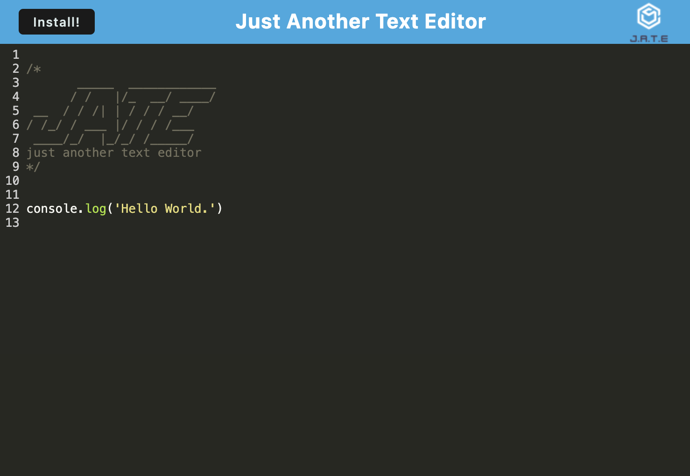

# editOff: a webpack text editor with offline capability

## Description

This is a text editor featuring installation as a PWA through webpack, caching, and offline capability.

Text editor functionality base on starter code [here](https://github.com/coding-boot-camp/cautious-meme).

Deployed on render [here](https://edit-off.onrender.com/).

## Screenshot

